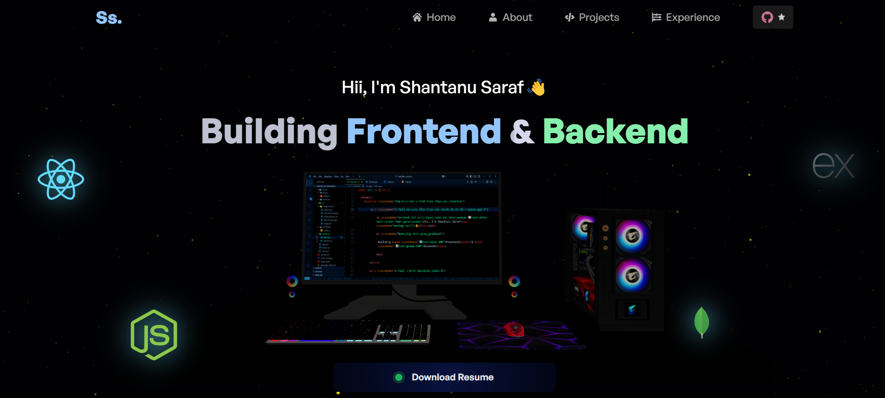

<h2 align="center">
  3D Portfolio Website 
  <a href="https://shantanu-saraf.vercel.app/" target="_blank">shantanu.dev</a>
</h2>

  

 

 &nbsp;
 &nbsp;

 &nbsp;

 

( This portfolio is inspired by [Adrianhajdin](https://github.com/adrianhajdin) ).

## Fork It, Own It

Feel free to fork, remix, and make this repo your own!  Just remember to give a little shoutout (a.k.a. proper credit) by linking back to [Shantanu421](https://github.com/shantanu421/portfolio-shantanu.git). Thanks!

## Technologies I've Used

- React.js
- Node.js
- Three.js
- React Three Fiber
- React Three Drei
- Email JS
- Vite
- Tailwind CSS

## Features

✨ **A stylish glass design, Bento-Style Bio**

 🖥️ **Explore live demos within a 3D computer, switching between projects effortlessly**

 🎨 **Each component features a modern design**

 📱 **Fully Responsive**

 ## 🛠️ Usage Instructions
 Create your own slick 3D portfolio:

 1. Clone this repository.

 2. Run ``npm install`` to grab all dependencies.

 3. Open the project folder, then navigate to ``src/constants/index.js`` and ``src/sections``. Inside, you'll find all of the details that you can customize. Edit the information to make it uniquely yours!

 4. Run ``npm start`` to start the development server.

 ## Show your support

 Give a ⭐ if you like my work on this website <3

